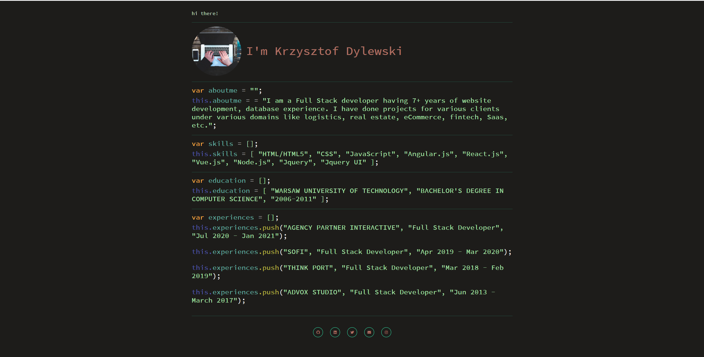
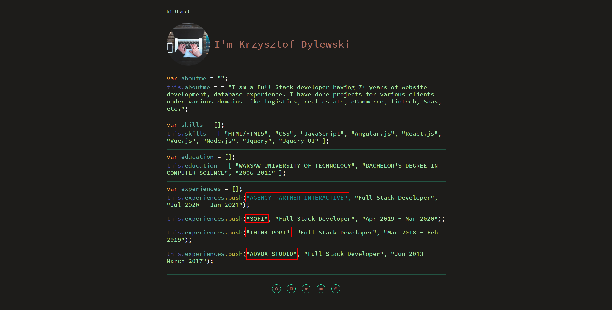
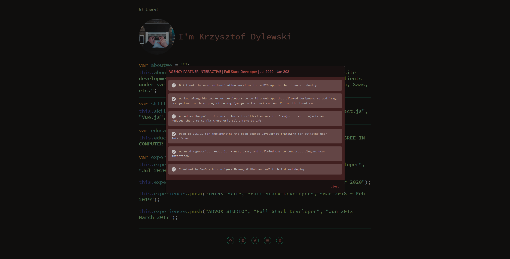

# Portfolio - Visual Studio Code Theme
This project was generated with [Angular CLI](https://github.com/angular/angular-cli) version 12.1.4.

# I use Angular 12 with bootstrap 5.

## Actual Portfolio

## Hover the company name then click to view details

## Experience Details

## Development server

Run `ng serve` for a dev server. Navigate to `http://localhost:4200/`. The app will automatically reload if you change any of the source files.

## Open for improvement for my vs code theme portfolio. Thanks!

